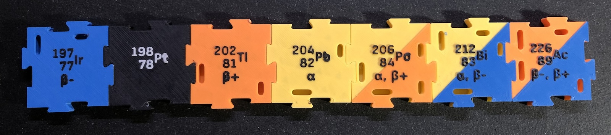

# Table of Nuclides Puzzle – Physics Model

**AMS optional, parametric design**

## Intro

The **table of nuclides** itself is a graphical representation of all known atomic nuclei, displaying their properties such as stability and decay modes. Unlike the periodic table, which organizes elements by their chemical properties and atomic number, the nuclide chart arranges isotopes of elements based on their **proton number (*Z*)** on the vertical axis and **neutron number (*N*)** on the horizontal axis. Each point on the chart represents a unique nuclide, characterized by a specific number of protons and neutrons. The chart provides crucial insights into the world of nuclear physics and especially into the decay chains of the isotopes.


This **puzzle of the table of nuclides** offers (at least) two opportunities to learn about the isotopes/nuclides. You’ll find attached a **work sheet** (EN/DE) with matching tasks for you(r students).

> 1️⃣ Sort the *element tiles* in the two dimensional grid of proton and neutron numbers and discover the **structure of the table of nuclides**. You must sort the elements and arrange them according to their number of protons (*Z*) and neutrons (*N*). Then you can discuss the different “axis” for isotopes (same *Z* ↔︎), isotones (same *N* ↕︎) and isobars (same *A*/mass ⤡).

After that you can talk about the different **decay modes** of each isotope, what happens in the nucleus and which particle are emitted. Then get to the second learning.

> 2️⃣ Build **decay chains** (or decay series) across the table by placing the matching *decay frames* to the tiles. Each isotope is either stable—only a few of the lighter nuclei—or has one or two possible decay modes: α, β⁻ and β⁺. Normally those modes are indicated with colored cells in the table but this set also provided a version (`p`; see below) where the modes can only be found by testing which *decay frame* fits on the *element tile*. Depending on which set of tiles you choose it will be more or less easy to find the right decay for an element and build the decay chain. To build a chain simply pick a random starting point and then arrange the *decay frames* until you reach a stable isotope. On your way it might happen that you come across an isotope with two possible decays; that's where your chain branches out to two paths. Follow both to a stable isotope.

Since it may take while to build the whole puzzle you may consider doing the first task with a smaller sub set and have prebuilt (and fixed/glued) versions of the whole set at hand for the second task.

The following image shows the partly build chart, where you can find multiple decay chains.


- Ir-198 → **Pt-198**
- Hg-206 → Tl-206 → **Pb-206**
- Po-206 → Bi-206 → **Pb-206**
          ↘︎ Pb-202 → Tl-202 → **Hg-202**
- Pb-212 → Bi-212 → Pa-212 → **Pb-208**
                                                  ↘︎  Tl-208 ↗︎                      

Each *element tile* has a certain configuration of holes matching the plugs of the *decay frames*, thus it is not possible to place a *decay frame* of an impossible decay mode. If an isotope like Bi-212 has two possible decay modes you can fit two frames on top of each other but the impossible third frame won't fit properly.


## About this set an its design

This set consist of multiple *element tiles* for different isotopes/nuclides (but not the full table, see image above and *Data source*). Furthermore the are some parts to build up the axis grid and the *decay frames*. The latter can be used to find the decay chains. There is one for each decay type that’s typically discussed in (german) schools: α, β⁻ and β⁺. Each *decay frame* has a certain combination of “plugs” thus fitting only on the *element tiles*, which are likely to decay in this way. The full model will span an area of about **120cm × 75cm** (or 48″ × 30″). However a **build plate size of 180mm × 180mm** ist big enough to print all parts.

Everything was designed to be printed completely **without color changes or with some manual color changes** at certain layer heights. I recommend the latte. The changes could be automated of course with an AMS, but I don’t have one thus can’t test ist or provide the profiles. See details about that in “Printing”.

The title and text on the axes are provided in **11 languages**: Danish, Dutch, English, French, German, Italian, Polish, Portuguese, Russian, Spanish, Swedish. I took most of the terms from Wikipedia and translated a few using DeepL. Let me know if there are mistakes. Other languages could be generated using the onshape files (see *Source*). The worksheet is provided in English and German.


### Versions of *element tiles*

There are different sets of *element tiles* to choose from depending on how much information should be printed on them and be visible for you(r students).

####  `p` – plain


Element symbol, number of protons and neutrons. The types of decay can be found only by trying which *decay frame* fits the tile. These tiles can be printed in the same color/filament. You might add a color change for the text layers (see *Printing*).

#### `pd` – plain with decay


Same as *plain* + text to indicate possible decays.

#### `cd` – color coded


Slement symbol, number of protons and neutrons. These tiles must be printed in different colors to indicate the decay type. Nuclides with two (equally likely) possible decays must be printed with a color change at a certain layer hight resulting in a diagonally divided top color (see *Printing*).

#### `cd` – color coded with decay



same as *color code* + text to indicate possible decays

### Data source

The information to generate the tiles where taken from the german formulary book [“IQB Formelsammlung”](https://www.iqb.hu-berlin.de/abitur/abitur/dokumente/mathematik/M_Mathematischna.pdf) ([better version](https://kuhmann.de/formelsammlung)) for senior classes, hence it is not the full table but only the part starting with Ir-120 to . Furthermore the full table would need quite some space if printed. However using onshape and OpenSCAD more *element tiles* can be auto generated (see *Source*).

## Folders and files

The whole project is organized as follows:

- `3mf/` contains all printing profiles (for Bambu Lab A1 mini)
- `isotpe_data/` contains the source files with the data for tile generation, which is an Apple Numbers file, a CSV version and the folder `table_of_nuclides_test/` with a LaTeX and PDF document to generate an overview of the data, e.g. to check for errors.
- `pictures/` contains some example images etc.
- `stl/` contains all STL files for printing
  - `axis/` contains the files for the coordinate system
    - `axis_origin_LANG`  = start of the coordinate system with three places for *element tiles*. `LANG` indicates the language for the title and axis text.
    - `axis_tip` = the arrow tip for both axis, this part is not necessary if you use the end piece, which include a tip.
    - `axis_x_middle`/`axis_y_middle` = middle piece for a longer x/y axis with three places for *element tiles*
    - `axis_x_end`/`axis_y_end` = end piece for the x/y axis with three places for *element tiles* and an arrow tip at the end
  - `frames/` contains the three *decay frames*.
    - `alpha_decay_frame`
    - `beta_minus_decay_frame`
    - `beta_plus_decay_frame`
  - `tiles/` contains the sub folders for the different sets of *element tiles*.
    - a folder for each set: `p/`, `pd/`, `c/`, `cd/`
    - the files inside this folders are named according to the following scheme: `i_sa_d`, e.g. `001_Ir197_bm`.
      - `i` = index number, which is counted in rows (same element) of the table of nuclides and then in columns thus one can easily select a certain region of the table.
      - `s` = element symbol
      - `a` = mass number
      - `d` = decays: `a` for α, `bm` for β⁻ and `bp` for β⁺ or `stable` for stable isotopes. If there are two possible decays those are combined with a dash `-`, e.g. `a-bm`. This makes it possible to filter the files according to the decay and select the right color/filament.
    - in `c/` and `cd/` the files are sorted in sub folders matching the decay mode. 
  - `tiles_test/` contains a subset of 7 isotopes, one for each decay combination and a stable one, for testing purposes.
- `tile_generation/` contains the OpenSCAD file, some base STLs and a Perl script to autogenerate all *element tiles* from the data source.
- `worksheet/` contains an example worksheet in English (DE) and German (DE).

## Printing

All elements were designed to be printed with **0.4mm nozzle** a **layer height of 0.15mm** on a printer without an automatic color changing system (AMS) and without supports. Manual (or automatic) color changes can be added at certain layer heights (see table). In the 3MF files I added pause commands to manually change the color, you may replace them with automatic color changes. If you want to print all parts in a single color, which is also possible, just remove the pause commands.

### Settings

- 0.15mm layer height
- 15% cubic infill
- 2 walls
- 4 top, 2 bottom layers for *element tiles* and *axis parts*
  3 top, 4 bottom layers for *decay frames*
- monotonic linear top/bottom surface pattern
- Arachne wall generator
- manual color changes, see table
- some elephant foot compensation for axis parts and element tiles

### Colors

If you print on of the plain sets (`p` or `pd`) you can also print the tiles in white and apply the color for the text with a marker to save some color changes. For a color set this might also work if the filament colors are not to dark.


Note: For the dual colored tiles (in set `cd` and `c`) I recommend to print the lighter color as base and then the darker on above it.


### Parts/BOM table

The quantities indicated in the following table are meant for one puzzle set. For multiple teams of students multiply the numbers accordingly.

In the table “Ori.” indicates the printing orientation, where “nrm” means “normal” i.e. the bottom of the model on the print bead and “usd” ist “upside down” meaning the top surface of the model should lay on the print bed. “CC1” and “CC2” say where one should add a color change. The number is the layer number and the length is the z height. Optional color changes are marked with “opt.”. “C1”, “C2” and “C3” are the colors to be used: C1 is the first color at print start, C2 the one after the *first* change and C3 the one to be used after the *second* change.

| Object/File              | Qty.     | Comment                                                     | Ori. | C1     | CC1             | C2     | CC2        | c3    |
| ------------------------ | -------- | ----------------------------------------------------------- | ---- | ------ | --------------- | ------ | ---------- | ----- |
| ***AXIS PARTS***         |          |                                                             |      |        |                 |        |            |       |
| `axis_origin_XX`         | 1        | —                                                           | nrm  | black  | opt. at 46/6.45 | white  | —          | —     |
| `axis_tip`               | 0        | optional instead of `axis_x/y_end`                          | nrm  | black  | —               | —      | —          | —     |
| `axis_x/y_mid`           | 8 x, 5 y |                                                             | nrm  | black  | —               | —      | —          | —     |
|                          |          |                                                             |      |        |                 |        |            |       |
| `axis_x/y_end`           | 1 each   | use `axis_tip` alternatively                                | nrm  | black  | —               | —      | —          | —     |
| ***DECAY FRAMES***       |          |                                                             |      |        |                 |        |            |       |
| `alpha_decay_frame`      | 9        | quantity depends on complexity/length of chains to be build | usd  | yellow | opt. at 5/0.75  | black  | —          | —     |
| `beta_minus_decay_frame` | 9        | quantity depends on complexity/length of chains to be build | usd  | blue   | opt. at 5/0.75  | black  | —          | —     |
| `beta_plus_decay_frame`  | 9        | quantity depends on complexity/length of chains to be build | usd  | orange | opt. at 5/0.75  | black  | —          | —     |
| ***ELEMENT TILES***      |          |                                                             |      |        |                 |        |            |       |
| `p[d]/…`                 | 1 each   | plain tile version (opt. inverse colors for stable)         | nrm  | white  | opt. at 43/6.45 | black  | —          | —     |
| `c[d]/…_stable`          | 1 each   | colored tile version, stable isotope                        | nrm  | black  | at 43/6.45      | white  | —          | —     |
| `c[d]/…_a`               | 1 each   | colored tile version, α decay                               | nrm  | yellow | at 43/6.45      | black  | —          | —     |
| `c[d]/…_bm`              | 1 each   | colored tile version, β⁻ decay                              | nrm  | blue   | at 43/6.45      | black  | —          | —     |
| `c[d]/…_bp`              | 1 each   | colored tile version, β⁺ decay                              | nrm  | orange | at 43/6.45      | black  | —          | —     |
| `c[d]/…_a-bm`            | 1 each   | colored tile version, α or β⁻  decay                        | nrm  | yellow | at 43/6.45      | blue   | at 45/6.75 | black |
| `c[d]/…_a-bp`            | 1 each   | colored tile version, α or β⁺ decay                         | nrm  | yellow | at 43/6.45      | orange | at 45/6.75 | black |
| `c[d]/…_bm-bp`           | 1 each   | colored tile version, β⁻ or β⁺  decay                       | nrm  | orange | at 43/6.45      | blue   | at 45/6.75 | black |

## Source

### CAD files

The models where build in onshape, and can be accessed [here at onshape.com](https://cad.onshape.com/documents/2f687641f79fdcb9482a307f/w/13f8bf820864813022ba3f0a/e/85a855f60f821b4c1a363548?renderMode=0&uiState=6783a41c96bc511beebf483e).

The tiles however were generated automatically using OpenSCAD, since onshape can’t automate this at the moment. You’ll find the required files here in the ZIP download as well.

#### Variables and configurations in onshape

The design in onshape uses the following variables. The design should be robust against changes and adapt accordingly, however it might lead to errors if you change to a certain combination of variables, e.g. a radius to big for the puzzle size etc. Furthermore the font sizes might need some tweaking after changing the tile size.

The languages are defined as configurations, you may change or add an entry in the table.

- general
  - `#LayerHeight`
  - `#NozzleSize`
- dimensions
  - `#TileSize` = size of an *element tile* without the puzzle notches
  - `#TileBaseHeight` = hight of the tile body without text
  - `#CornerRadius` = radius for most corners
  - `#SecondDecayHeight` = extra height for a second decay color overlay
  - `#PuzzleTolerance` = tolerance for the puzzle notches etc.
  - `#PuzzleRadius` = radius for the puzzle notches
  - `#DecayFrameWidth` = width of the *decay frames*
  - `#DecayFrameHeight` = hight of a *decay frame* base
  - `#DecayFrameSep` = distance between the *decay frame* and the *element tile* text
  - `#DecayFrameBorder` = extra space around the tile/frame for the decay arrows
  - `#DecayFrameTextDepth` = depth of the embossed text on *decay frames*
  - `#DecayPlugToleranceXY` = tolerance for the *decay frame* plugs in x and y direction
  - `#DecayPlugToleranceZ` = tolerance for the *decay frame* plugs in z direction
  - `#DecayHoleBaseHeight` = hight of bottom of decay holes in *element tiles*
  - `#DecayPlugWidth` = width of *decay frame* plugs
  - `#DecayPlugLong` = size of the long *decay frame* plugs
  - `#DecayPlugShort` = size of the short *decay frame* plugs
  - `#DecayPlugSep` = distance between two plugs
  - `#DecayPlugHeight` = hight of the plugs
  - `#TextHeight` = hight of the text on *element tiles*
  - `#FontSizeSymbol` = size of the element symbol on *element tiles*
  - `#FontSizeNumbers` = size of the element numbers A and Z on *element tiles*
  - `#FontSizeDecays` = size of the element decays on *element tiles*
  
    Please note, that if you change this size (or the font) you’ll have to manually adjust the stencils.
  - `#StencilWidth` = width of manual stencils for text on *decay frames*
  - `#FontSizeTitle` = size of the axis title
  - `#FontSizeAxis` = size of the axis text
  - `#FontSizeDecay` = size of the decays on *decay frames*
  - `#AxisThickness` = tickness of the axis line
  - `#AxisTextHeight` = hight of the text on axis
- text and information
  - `#AxisTextTitle` = title on axis
  - `#AxisTextProtons` = text for Z (y) axis
  - `#AxisTextNeutrons` = text for N (x) axis
  - `#AxisTextArrowSymbol` = arrow symbol used in text for both axis
- variables for data on *element tiles*
  - `#ElementSymbol` = element symbol
  - `#ElementMass` = mass number A
  - `#ElementProtons` = atomic number Z
  - `#ElementDecays` = text to indicate decays

### Tile generation with OpenSCAD and Perl

The tiles were generated with OpenSCAD and a Perl script. Out is necessary to install [Sofia Sans](https://github.com/lettersoup/Sofia-Sans) and [M+ 1c Rounded](https://fonts.google.com/specimen/M+PLUS+Rounded+1c). On macOS copy the font files to `~/Library/Fonts` and restart OpenSCAD (it might won’t work if you use a special font manager, that activates fonts in a different way).

#### Additional variables in OpenSCAD

In the OpenSCAD file you’ll find some of the onshape variables and in addition to that the file adds the following ones:

- `showDecaysText` = if true the decay text is visible on the tile
- `markSecondDecay` = if true the has an extra layer for diagonal coloring
- `alphaDecay` = if true the alpha decay holes will be "punched”
- `betaMinusDecay` = if true the beta minus decay holes will be "punched”
- `betaPlusDecay` = if true the beta plus decay holes will be "punched”
- `fontQuality` = defines the rendering quality of the text
- `fontAlignFrameBase` = position of the lower edge of the text frame in onshape
- `fontAlignSymbolBase` = baseline for the element symbol text
- `fontAlignSymbolBaseWithoutDecays` baseline for the element symbol text, if there is no decay text
- `actualTextHeight` = extrusion height of the text, adapted to wether the second decay indicator is present or not
- `textWidth(Symbol|Mass|Protons)` = measures the with of the text element to calculate the center
- `textShiftX` = shift of the element text including the numbers to be centered on the tile

#### Autogenerate the tiles

To generate the tiles open a Terminal / command window at `tile_generation/` and run

```shell
perl tile_generator.pl
```

The script will then ask if you want to delete existing tile STLs and start generating the tiles with OpenSCAD using `isotope_data/isotope_data.csv`  for the text and the STLs in `tile_generation/stl_to_import/` to create the tile base. This process may take a while since 4 × 276 = 1.104 STLs will be generated in total.

If you want to add more elements/isotopes or change something else, change the CSV file or the Numbers file and export a CSV file. Then run the script as described above.

You can then use the script `sort_tiles_by_decay.pl` to sort the tiles in sub folders by decay mode. Change the folder with tiles to be sorted in line 9 of the script.
